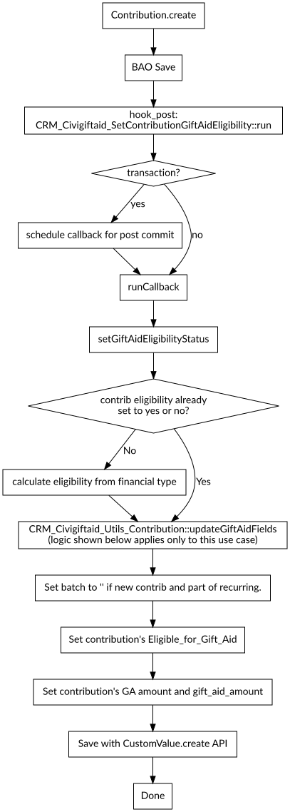

# Reference

## How contributions get updated.

A `hook_civicrm_post` is added via Symfony in
`civigiftaid_civigiftaid_civicrm_config()`. Perhaps confusingly,
a non-symfony version of this hook is *also* implemented by the function
`civigiftaid_civicrm_post()` for a different purpose (see declarations
below).

## How individuals' declarations are updated.

`hook_civicrm_postProcess` is used to store submitted form declaration
data on the session under `uktaxpayer`. (Note: it won't replace an
existing session value, which could be a bug if someone goes back from
confirmation page and changes it?)

Currently uses a `hook_civicrm_post()` that fires where the objectName is
`Contribution` and the operation is either `edit` or `create`. This checks
for a transaction and if one is active it schedules a callback using
`PHASE_POST_COMMIT`, otherwise it calls it immediately.

The callback, `civigiftaid_callback_civicrm_post_contribution` calls
`CRM_Civigiftaid_Declaration::update($contributionID)` but ensures this is
only called once for the duration of the script.

That method looks for `uktaxpayer` on the session, and then proceeds to
process it if found.
